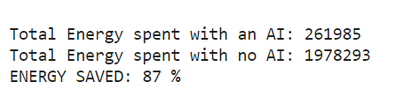

# EcoCooler - Capstone project for the course CS 541: Artificial Intelligence under Prof. Jie Shen at Stevens Institute of Technology
### Everything implemented from scratch using only python, numpy and tensorflow/keras.


### Project Overview
This project aims to reduce energy consumption in the cooling and heating systems of a data center. Inspired by DeepMind's successful application of Deep Q-Learning to reduce Google's data center cooling costs by 40% in 2016, we implement a similar AI-based approach for efficient server temperature regulation. Our solution achieves up to 87% energy savings through Deep Q-Learning (DQN).

### Problem Statement
Data centers consume large amounts of energy to maintain optimal operating temperatures for servers and equipment. This project focuses on minimizing energy costs by optimizing the cooling and heating actions using AI.

### Solution Approach
The AI model is developed using Deep Q-Learning, which optimizes server temperature regulation through experience replay, exploration-exploitation, and environment simulation. The neural network architecture includes fully connected layers with Mean Squared Error loss and the Adam optimizer, achieving efficient and low-cost temperature predictions.

### Key Components

1. Environment Simulation: Defines real-time conditions including user load, data transmission, and atmospheric temperature.

2. Neural Network (Brain): Predicts optimal actions based on current state to minimize energy use.

3. Deep Q-Learning with Experience Replay: Enhances learning efficiency and stability.

4. Early Stopping: Prevents overfitting by halting training once optimal performance is reached.


### Dependencies

1. Python 3.x

2. NumPy

3. TensorFlow/Keras

### Installation

To install the required packages, run:

```python
pip install numpy tensorflow keras
```

### Usage

Clone the repository:

```python
git clone https://github.com/yourusername/minimizing-energy-consumption.git
```

Run the main script to train the model:

```python
python main.py
```

### Project Setup and Execution

1. Environment Setup
Define an environment simulating atmospheric conditions, user traffic, and data rate. Initialize key parameters: temperature, user count, data rate, and other operational limits.

```python
class Environment:
    def __init__(self, optimal_temperature=(18.0, 24.0), initial_month=0, initial_number_users=10, initial_rate_data=60):
        # Set initial parameters, temperature ranges, and user/data limits
        ...
    def update_env(self, direction, energy_ai, month):
        # Update environment based on AI action and compute reward
        ...
    def reset(self, new_month):
        # Reset environment parameters for a new training episode
        ...
    def observe(self):
        # Observe the current state, reward, and game status
        ...
```

2. Neural Network Architecture (Brain)

Implement a fully connected neural network with input, hidden, and output layers.
Use Dropout layers to improve generalization and prevent overfitting.
The model is compiled with Mean Squared Error loss and Adam optimizer.

```python
class Brain:
    def __init__(self, learning_rate=0.001, number_actions=5):
        # Initialize the neural network with dropout for regularization
```

3. Implement Deep Q-Learning with Experience Replay

Store experiences (state transitions) in memory for more stable learning.
Use stored experiences to train the model in batches, improving training stability.

```python
class DQN:
    def __init__(self, max_memory=100, discount=0.9):
        # Initialize memory and discount factor for experience replay
        ...
    def remember(self, transition, game_over):
        # Save a state transition to memory
        ...
    def get_batch(self, model, batch_size=10):
        # Retrieve and process batch data from memory
        ...
```

5. Training the AI Agent
   
The AI is trained using Deep Q-Learning with an exploration-exploitation strategy for optimal action selection.
Early stopping is implemented to avoid overfitting and halt training when improvements cease.

```python
# Initialize environment, brain (neural network), and DQN (experience replay)
env = Environment(optimal_temperature=(18.0, 24.0), initial_month=0, initial_number_users=20, initial_rate_data=30)
brain = Brain(learning_rate=0.00001, number_actions=5)
dqn = DQN(max_memory=3000, discount=0.9)
```


6. Train the model with early stopping

```python
for epoch in range(1, number_epochs):
    ...
    # Early stopping condition
    if early_stopping and patience_count >= patience:
        print("Early Stopping")
        break
```

### Results

After training, the model shows significant energy savings by making intelligent heating/cooling decisions.
The AI model achieves up to 87% reduction in energy consumption compared to conventional systems.




### Conclusion

This project demonstrates the power of AI in reducing energy costs by optimizing cooling and heating systems in data centers, with significant improvements in cost-effectiveness.


